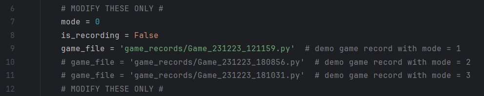
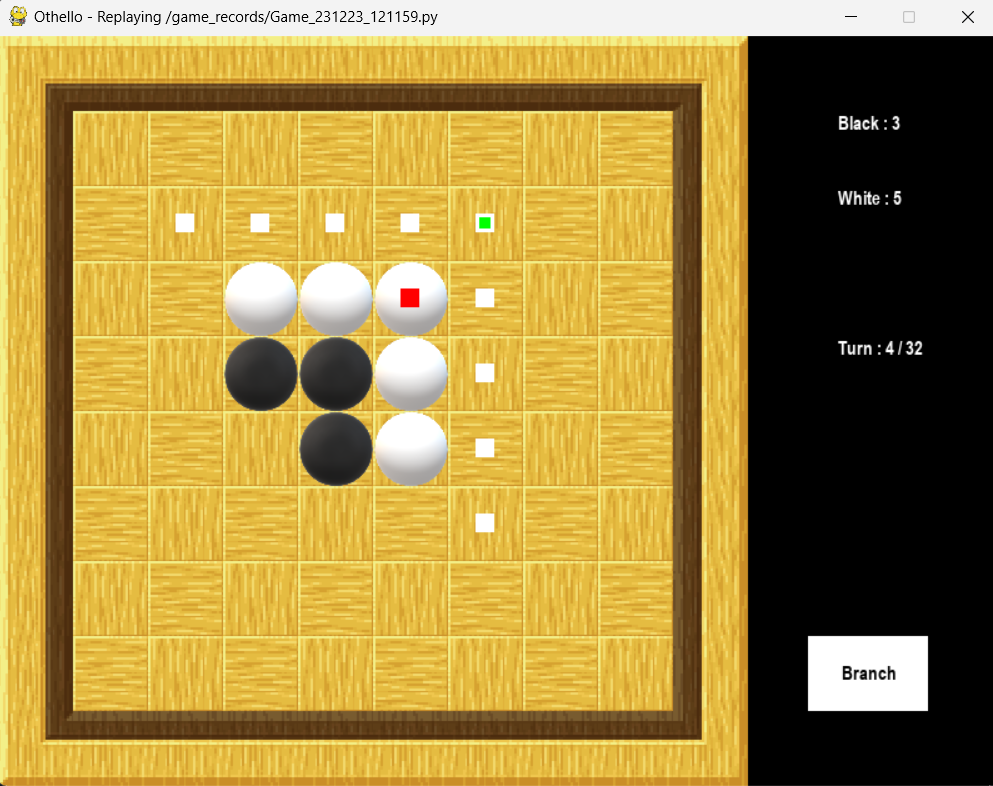
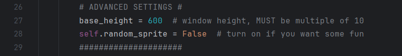
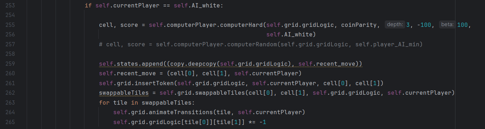
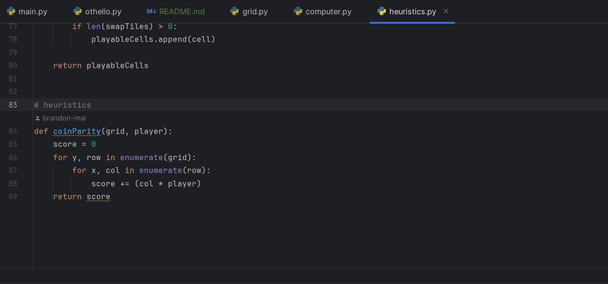

# Pygame Othello for Capstone Project
Or Pythello, because... y'know, Python and Othello... ahahaha, yeah I'll see myself out.

## Basic adjustments
Head to `main.py`

`mode`
- `0`: replay the game file indicated in `game_file` variable
- `1`: human vs. AI
- `2`: AI vs. AI
- `3`: AI. vs. human

`is_recording` indicates whether the game is recorded or not.
Recorded game will have a red 'Recording' on upper left corner of the window.
Game record is stored in `/game_records`.

`game_file` indicates the path to game record that you want to replay in `mode = 0`.
 
 

While in replay mode, use forward/backward arrow keys to navigate through moves.

In games with human player, a 'Branch' button will appear on human-to-move turns.
Click on it to make a new game record where you can retake the move.
 
 

## Advanced adjustments
Head to `othello.py`

`base_height` will decide the game window height (and thus scale all other UI elements accordingly).

`random_sprite` if you want cool random board designs.
 
 

Change AI's evaluating functions down in `update()` method.
I swear I'll bring this to `main.py` very soon for easier modifications.
 
 

Add heuristics into `heuristics.py`.
 
 

And you can change/add spritesheets and more in `grid.py` if you know what
you are doing, but please don't :)
 
 

## To do list
- [ ] More heuristics
- [ ] Improve game record/rollback method
- [ ] Folder for papers, etc.
- [x] Turn counter for more advanced evaluating functions
- [ ] Time per turn record (để đánh giá heuristics maybe)