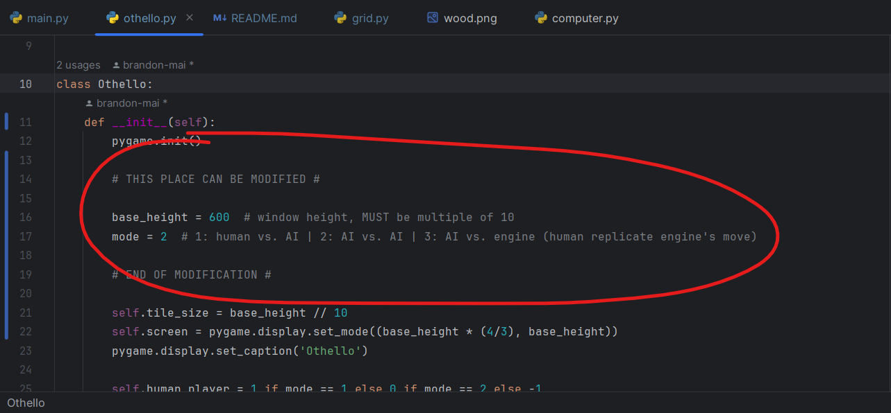

# Pygame Othello for Capstone Project

## How to make the most use out of this

Change these settings in othello.py to your liking!
- To resize the window, modify the value of `base_height` to something a multiple of 10.
- To select the game mode, modify the value of `mode` accordingly.
- To get new board design every game restart, change `random_sprite` to True
 
 
 

You can edit evaluating function right under `update(self)` in othello.py (circled red).
Default method is `computerRandom()`, which picks a random valid move.
 
 
 

Add heuristics into heuristics.py file, completely separate from utility_functions.py
for easier modifications.
 
 
 

## To be added in *very* near future
-[ ] More heuristics
-[ ] Folder for papers, game record, etc.
-[x] Turn counter for more advanced evaluating functions
-[ ] Time per turn record (để đánh giá heuristics maybe)