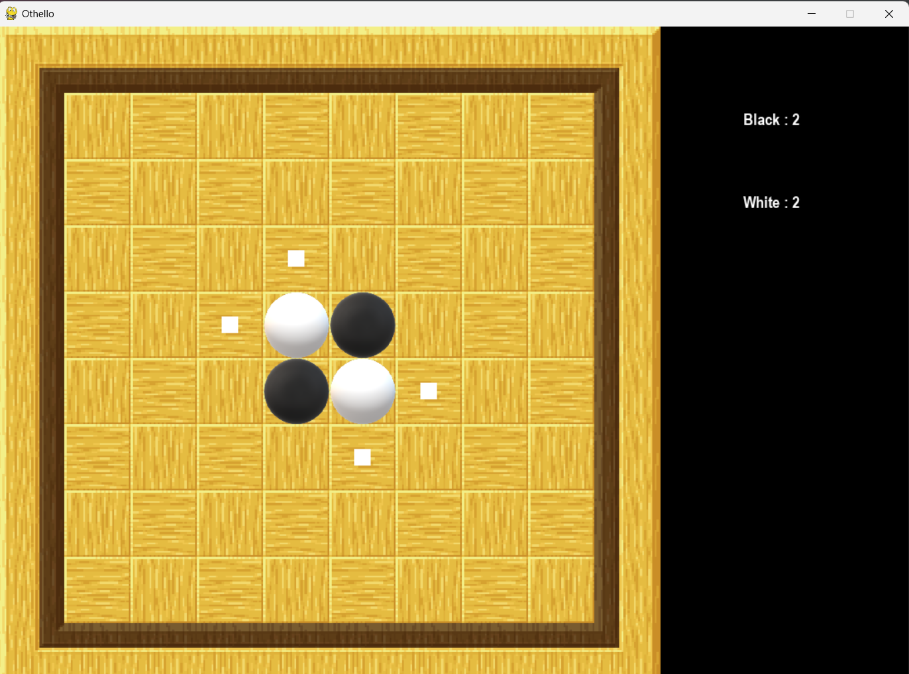
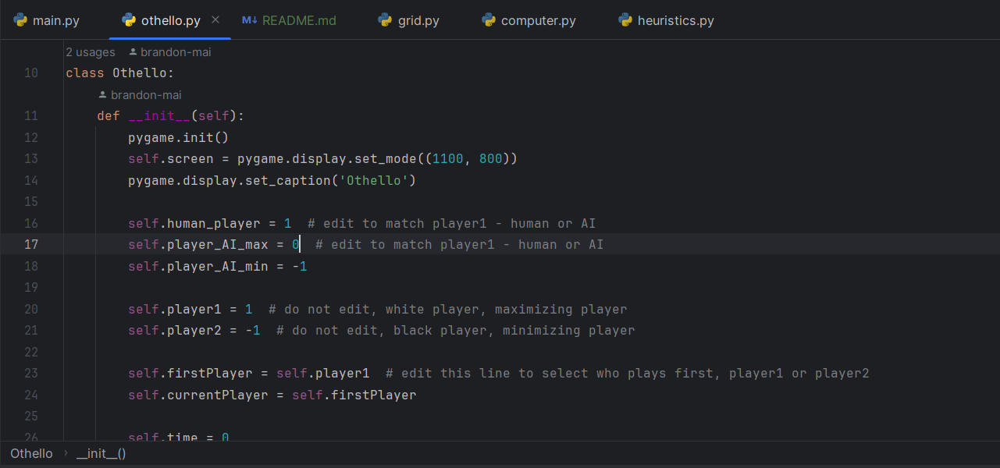
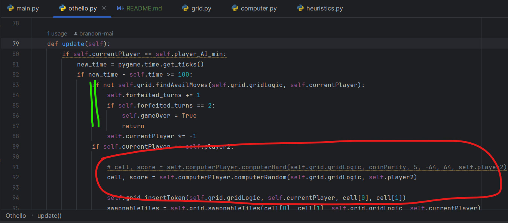

# Pygame Othello for Capstone Project

## What did I change? (compared to Duc An's version)



Flipped black and white pieces, so now the first player (either human or AI)
will be black piece and start from this more standard position.
<br>
<br>
<br>



Added another AI player as the first player, so we can maybe compare
different heuristics by letting them fight.
- Human vs. AI: ```human_player = 1``` and ```player_AI_max = 0```
- AI vs. AI: ```human_player = 0``` and ```player_AI_max = 1```
<!--end-->
<br>
<br>



Fixed the "unable to skip turn" issue (in green).

Now we can edit evaluating function right under ```update(self)```
in othello.py. Default method is computerRandom, which picks a random valid move (in red).
<br>
<br>
<br>


Added heuristics.py file, completely separate from utility_functions.py
for easier modifications.
<br>
<br>
<br>

## To be added in *very* near future
- More heuristics
- Folder for papers, game record, etc.
- Turn counter for more advanced evaluating functions
- Time per turn record (để đánh giá heuristics maybe)